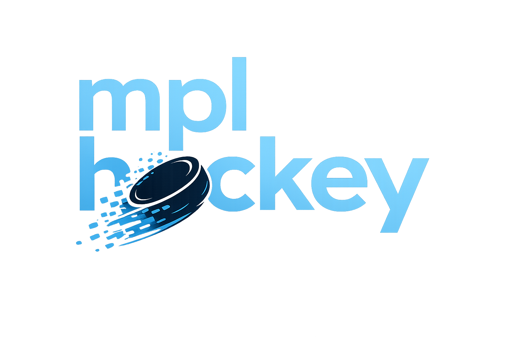
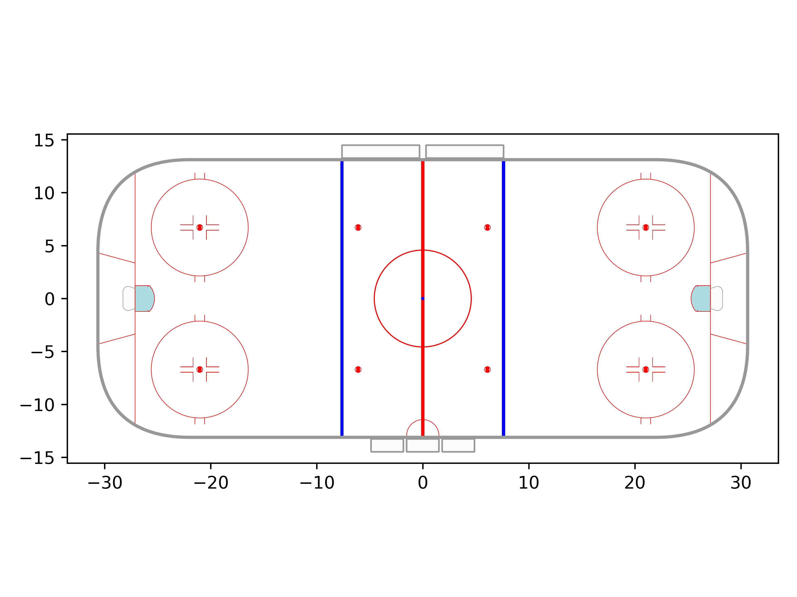
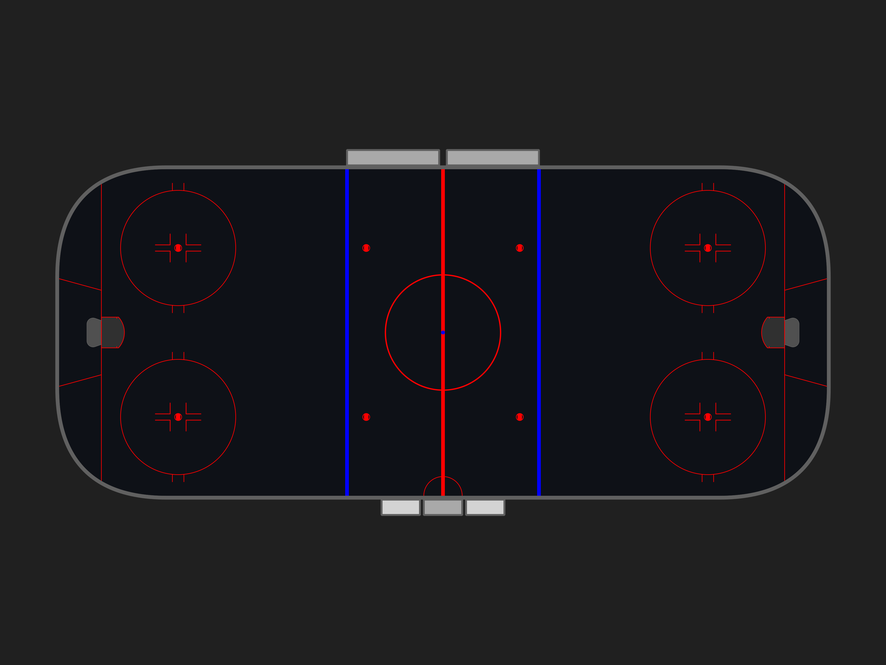
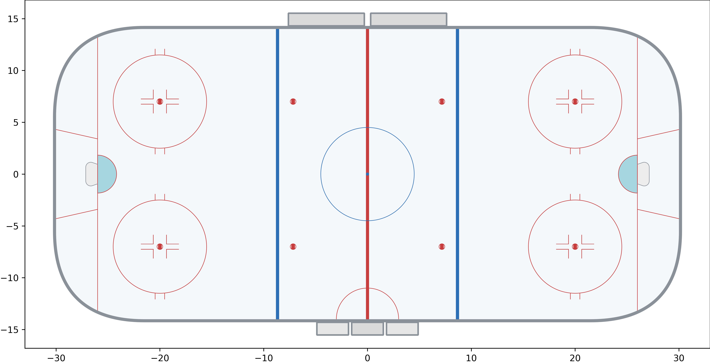
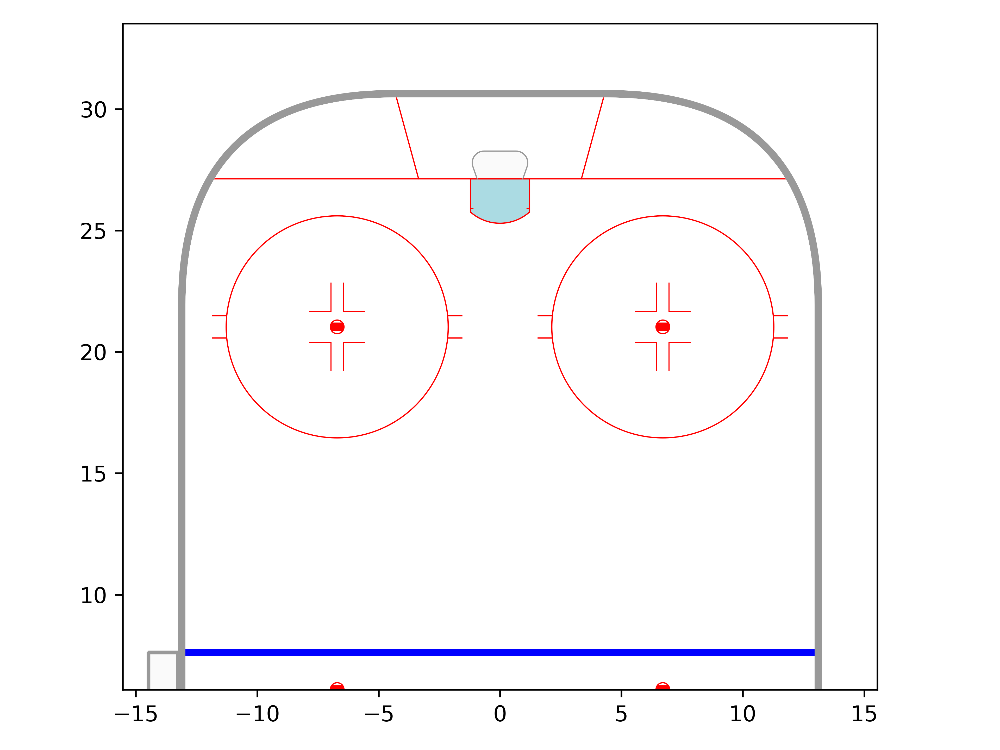
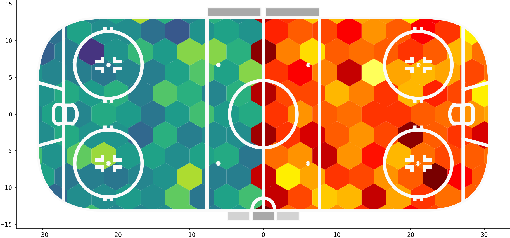

<p align="left">
  
</p>

`mplhockey` is a Python library for plotting hockey rink charts in Matplotlib.

It provides accurate, publication-ready rink geometries across multiple leagues, with flexible unit handling, rotation, and zone-based rendering. The library is intentionally lightweight and designed to integrate cleanly into standard Matplotlib workflows.

---

## Installation

Use the package manager `pip` to install `mplhockey`.

```bash
pip install mplhockey
```

Alternatively, you can install it in development mode directly from GitHub:

```bash
git clone https://github.com/mlsedigital/mplhockey.git
cd mplhockey
git checkout develop && git pull
pip install -e .
```

If you are using `uv`, you can add it directly to your project:

```bash
uv add mplhockey
```

---

## Quick start

Create and draw a standard NHL rink:

```python
from mplhockey import NHLRink

rink = NHLRink()
rink.draw()
```
<p align="center">
  
</p>


All rinks expose the units they are currently parameterized in:

```python
rink.units
```

You can control the units directly when constructing the rink:

```python
rink = NHLRink(units="m")
rink.draw()
```

Or override the units at draw time:

```python
rink.draw(units="mm")
```

## Other Themes

By default we show the `light` theme, but there is also a `dark` theme for each rink which is accessible on the constructor.

```python
from mplhockey import NHLRink
import matplotlib.pyplot as plt

fig, ax = plt.subplots()

rink = NHLRink(theme="dark")
rink.draw(ax=ax)

ax.set_axis_off()

# Make EVERYTHING dark
ax.set_facecolor("#202020")
fig.patch.set_facecolor("#202020")
plt.show()
```
<p align="center">
  
</p>


### Custom Themes

Default schemes are housed in a `schemes.yaml` file which lays out colours each of the elements. Optionally, when the rink object is instantiated, you can pass in a dictionary that explictly defines those items. For example:

```python
from mplhockey import KHLRink

my_theme = {
    "ice": "#F4F8FB",          # very light icy white-blue
    "outline": "#8A9199",      # cool neutral gray (softer than pure gray)
    "red": "#C83E3E",          # slightly muted hockey red (less neon)
    "blue": "#2C6FB7",         # deep rink blue (good contrast on ice)
    "crease": "#A6D6E0",       # soft cyan / goalie-crease blue
    "net": "#EDEDED",          # off-white (avoids pure white glare)
    "penalty_box": "#E6E6E6",  # subtle light gray
    "bench": "#DADADA",        # slightly darker than penalty box
}

rink = KHLRink(
    theme = my_theme,
    units = 'm',
)

rink.draw()
```
Will produce something like:
<p align="center">
  
</p>


---

## Rotation and display ranges

Rinks can be rotated by passing a `rotation` argument (in degrees) either to the constructor or the `draw` method.

You can also render only a subset of the rink, such as a single zone:

```python
from mplhockey import NHLRink

rink = NHLRink()
rink.draw(rotation=90, display_range="ozone")
```
<p align="center">
  
</p>

This is particularly useful for producing attacking-direction–consistent visualizations or focused zone-level analyses.


The default themes are great for showing animations of a hockey game or showing event locations from other data providers. However, for heatgrids they tend not to show up too well, so we've included two other themes `over-dark` and `over-light` which make the colour of the rink-markings uniform.

<p align="center">
  
</p>


---

## Coordinate system

All rinks in `mplhockey` are defined in a right-handed Cartesian coordinate system centered at center ice:

- The origin `(0, 0)` is at center ice
- The x-axis runs along the length of the rink
- The y-axis runs across the width of the rink

This coordinate system makes it straightforward to overlay spatial data such as shot locations, tracking data, or model outputs, while preserving geometric correctness across leagues and unit systems.

---

## Customization and Matplotlib integration

Rinks are rendered as standard Matplotlib artists. This means:

- You can freely overlay scatter plots, lines, contours, or heatmaps
- Axis limits, aspect ratios, and styling behave exactly as expected
- Figures can be exported to PNG, SVG, PDF, or any Matplotlib-supported format

The goal is to provide a clean geometric foundation without constraining downstream visualization choices.

---

## Supported rinks

`mplhockey` currently supports the following rink types:

- `NHLRink` (National Hockey League Rink)
- `NCAARink` (National Collegiate Athletic Association Rink)
- `IIHFRink` (International Ice Hockey Federation Rink)
- `KHLRink`  (Kontinental Hockey League Rink)
- `PWHLRink` (Standard PWHL Rink; same as NHL Rink)
- `NRLRink` (Standard Ringette Rink)

All rink classes accept an optional `units` argument, allowing them to be reparameterized consistently in different unit systems.

The design is intentionally extensible, making it straightforward to add new leagues, historical dimensions, or custom surfaces.

---

## Design philosophy

`mplhockey` is deliberately focused on geometry and rendering only.

It does not:
- Fetch or manage hockey data
- Impose a data model for events or players
- Replace general-purpose plotting libraries

Instead, it aims to be a robust, composable building block for analysis, research, and visualization pipelines.

Users familiar with `mplsoccer` should find the mental model immediately familiar, adapted to the conventions and geometry of hockey.

---

## License

`mplhockey` is released under the **MIT License**.

You are free to use, modify, and redistribute this software for both commercial and non-commercial purposes. See the `LICENSE` file for full details.

---

## Acknowledgements

`mplhockey` is inspired by the design philosophy and success of `mplsoccer` and `mplbasketball`, adapting similar ideas to the unique geometric and visualization needs of hockey.

